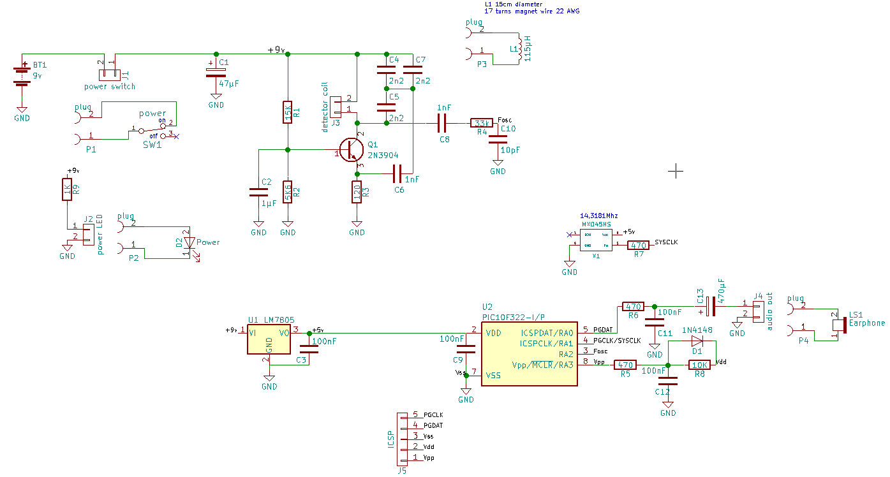
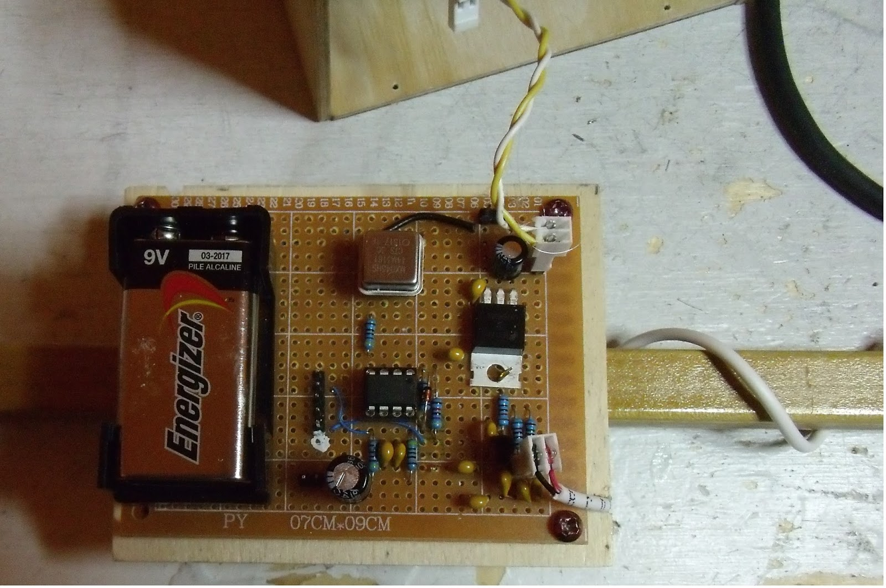
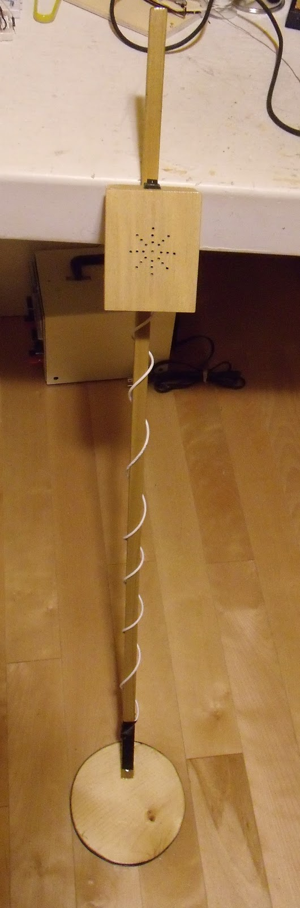

metal_detector
==============

A simple metal detector built around a PIC10F322 and a 2N3904 common base Colpitts oscillator. Although this detector is not as sensitive as a commercial one,
it is cheap to build and is a good weekend project.

schematic
---------

description
-----------
  The **PIC10F322** is clocked by an external crystal oscillator for stability. The chosen oscillator frequency is 14.3181Mhz (available on hand, any value up to
 16Mhz is good).

  The Colpitts oscillator use a 6" coil as detector. The oscillator output is sent to **T0CKI** input (PIC10F322 pin 3) and **TIMER0** count the number of oscillator 
cycles during a fixed lapse of 32 msec. This 32 msec period is fixed by **TIMER2** which is used as period counter for the **PWM1** audio generator. The alarm audio tone
is at 500 hertz or 2 msec period. The postscaler of **TIMER2** is set to trigger an interrupt at every 16 audio period or 32 msec. The detection is done inside the interrupt service routine by comparing the value from **TMR0** register with the previous reading saved in variable **last**. Oscillator frequency must change in same direction some consecutives reading to signal a detection. The constant **TR_LVL** determine that number of consecutives changes.
Variable **slope** is incremented when **TMR0>last** and decremented when **TMR0<last**. If **TMR0=last**  **slope** is reset to 0 and the tone is disabled. To trigger
an alarm the absolute value of **slope** must be greater or egual to **TR_LVL**.

  The oscillator frequency is around 460 Khz that give 14720 cycles for a lapse of 32 msec. Only the modulo 256 count is kept as from one lapse to the next this value vary only a few count. 

  When a tone is triggered the detector must be swept back and forth over the spot to confirm detection. When the coil stand still over the object the oscillator stabilize at a new frequency and the alarm stop.

  This simple scheme allow for oscillator frequency drift which are too slow to trigger an alarm.

some math
---------

value of register PR2 for a tone of 500 Hertz

PR2=(FCY/PRESCACLE/500)-1

FCY=XOfreq/4  

XOfreq=14.3181Mhz

PRESCALE=64

**PR2**=(3,579,525/64/500)-1=**111**  (division rounded to nearest integer)

The **32 msec** sample period and **TR_LVL** value of 2 are empiral from testing different setting.

Oscillator count modulo 256 during 32 msec sample period

**TMR0**=(460,000*0.032)%256=**128**    (at TMR0 range center, perfect! Give room for oscillator drift in both direction.) 

Electronic assembly
--------------------

 The circuit is mounted on a 7cm x 9cm bakelike circuit board with single side 0.1" spaced copper pads. For stability an external crystal oscillator was used instead
of the internal MCU RC oscillator. XO is running at 14.3181 Mhz because it is what I had in hand. This MCU can work up to 16Mhz. 

Machanical assembly
-------------------

  A disk was cut in a 3/4" thick pine plank and a groove was carved on the circumference using a round file. 17 turns of 22 AWG magnet wire was wounded in this groove for a measured inductance of 115µH. A 1/2" square poplar stick was glued to this disk as an handle. To hold the circuit board 1/8" thick birch plywood was used
to build a small box.

Testing metal detector
----------------------

Link to short video of [detector testing](https://youtu.be/6JHq25r9XMA)

parts list
----------

* 1 PIC10F322  DIP-8 format MCU  **U2**
* 2 DIP-8 socket for **U2** and **X1**
* 1 Crystal oscillator CTS MXO45HS 14.3181Mhz  **X1**
* 1 LM78M05CT  5 volt regulator TO-220  **U1**
* 1 2N3904 NPN TO-92 general purpose junction transistor **Q1**
* 1 SPST rocker switch 1/2" x 3/4" size, power switch  **SW1**
* 1 9 volt battery holder
* 1 9 volt battery  **BT1**
* 1 47µF/25 volt electrolytic capacitor **C1**
* 1 1µF/25 volt electrolytic capacitor **C2**
* 1 15K 1/4watt 1% resistor **R1**
* 1 5k6 1/4watt 1% resistor **R2**
* 1 120 1/4watt 1% resistor **R3**
* 3 2.2nF ceramic NPO capacitor **C4,C5,C7**
* 2 1nF ceramic capacitor **C6,C8**
* 1 10pF ceramic capacitor **C10**
* 1 33K 1/4watt 1% resistor **R4**
* 4 100nF ceramic capacitor **C3,C9,C11,C12**
* 3 470 1/4watt 1% resistor **R5,R6,R7**
* 1 1N4148 diode  **D1**
* 1 10K 1/4watt 1% resistor **R8**
* 1 1K 1/4watt 1% resistor **R9**
* 1 3mm LED power **D2**
* 1 470µF/16volt electrolitic capacitor **C13**
* 1 2" small speaker or jack for earphone **LS1**
* 30 feet  22 AWG magnet wire for **L1**
* 4  1 row 2 pins connector .1" spacing for **J1,J2,J3,J4**
* 4  1 row 2 holes female connector .1" spacing for **P1,P2,P3,P4**
* 1  1 row 5 pins connector for ICSP **J5** (pickit 3 programmer).
* 1 bakelite prototyping board 7cm x 9cm with 0.1" spacing copper pad on one side. 
* 1 piece of pine 3/4" thick, large enough to cut 6" disk.
* 1 stick to used as handle glued to detector disk
* 1 about 4 feet 2 x 22AWG wires cable  to link detection coil to circuit board.
* 4 feet vinyl electrical tape to protect L1 winding.
* 1 12" x 12" x 1/8" birch plywood to make circuit board housing box.
* 1 small piece of 1/4" plywood to hold circuit board and box base.
